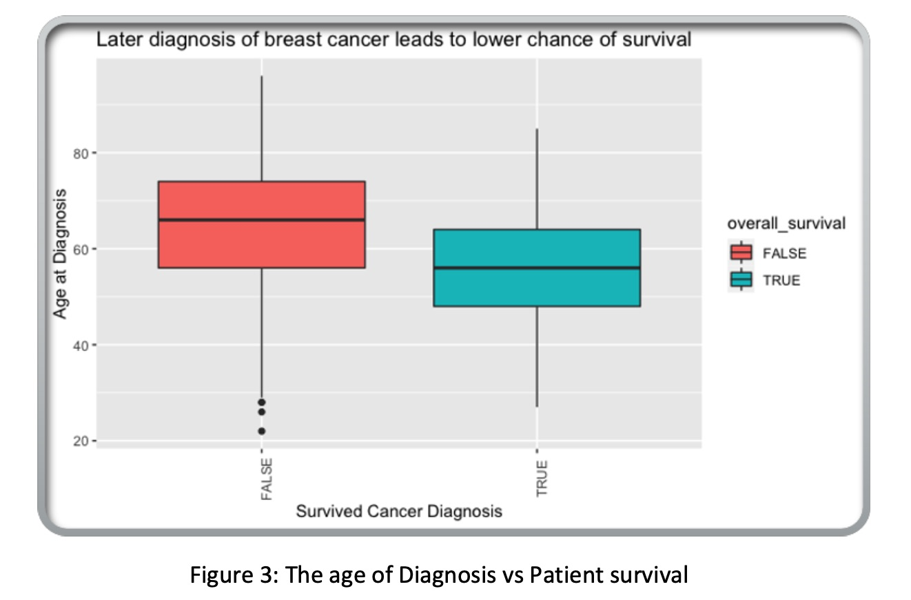
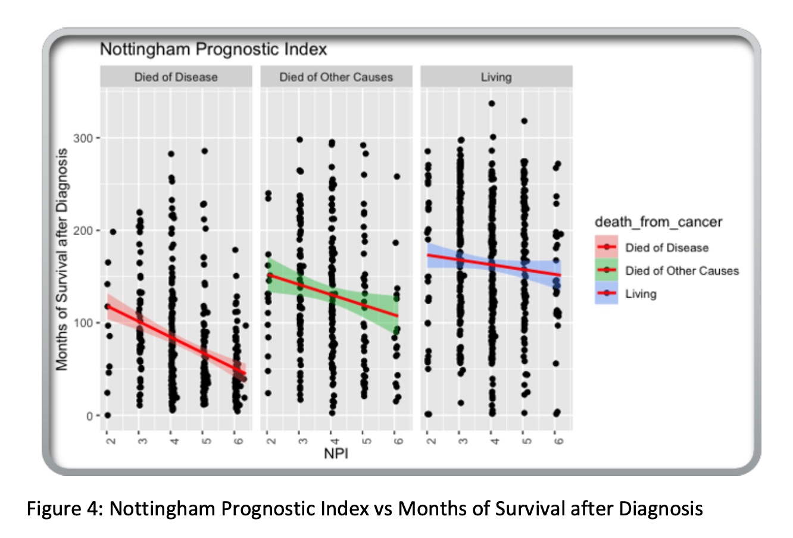
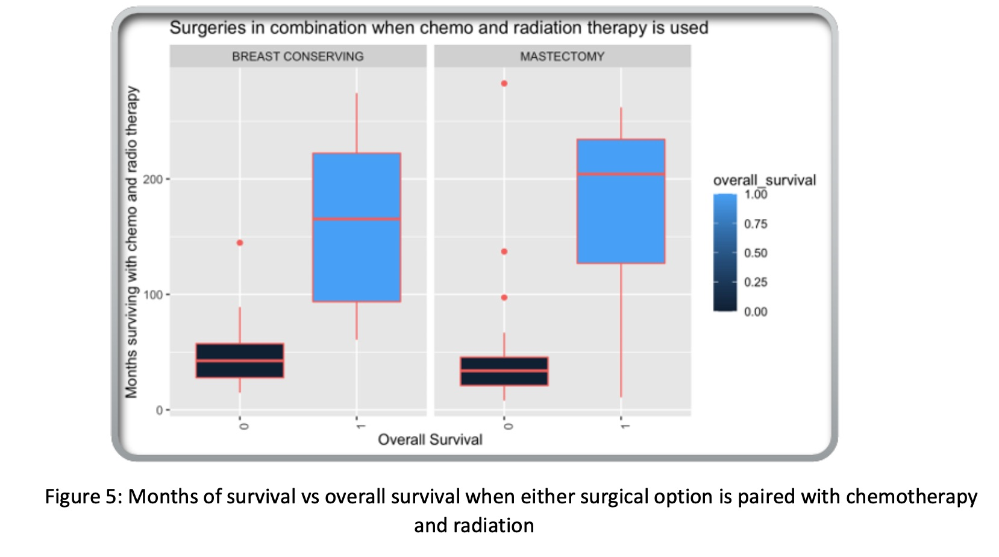
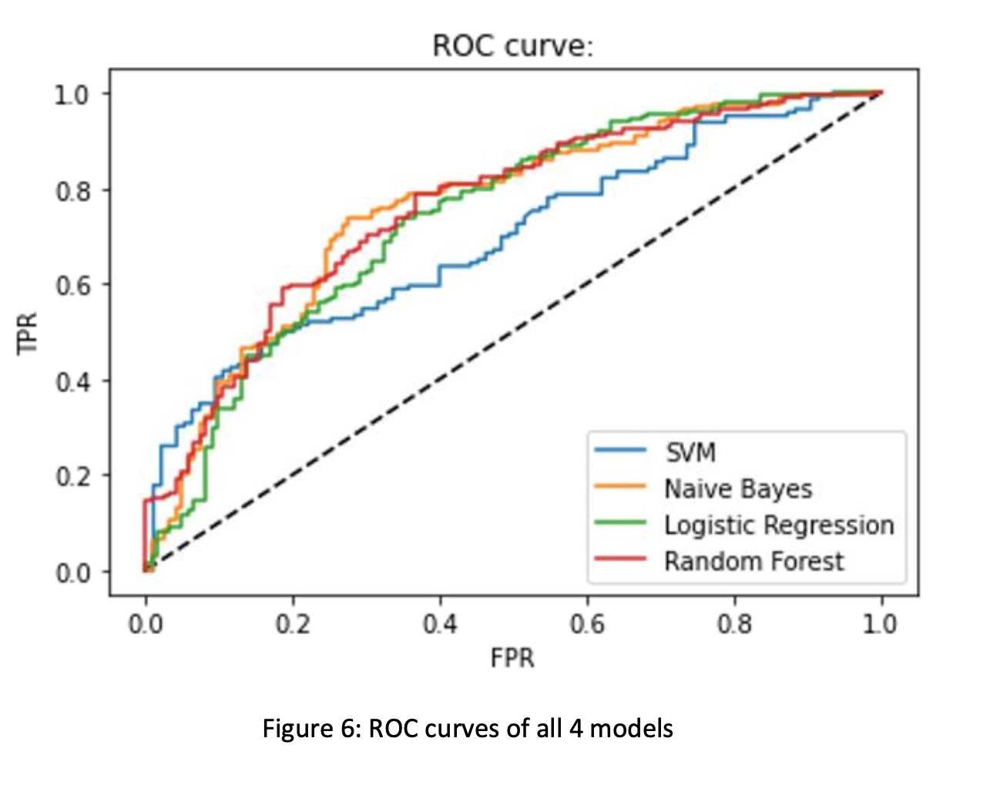

# Predicting-Breast-Cancer-Survivability

## Background and motivation: 

Breast cancer is the most prevalent form of cancer, which is also responsible for the highest number of cancer-related deaths among women. The American Cancer Society estimates that about 288,000 women worldwide will be diagnosed with breast cancer in 2022. Cancers are associated with genetic abnormalities. Gene expression measures the level of gene activity in a tissue and gives information about its complex activities. Comparing the genes expressed in normal and diseased tissue can bring better insights about the cancer prognosis and outcomes.

## Project Goal:

Our goal is to analyze the attributes in our dataset and find ones that display a relationship with the best chances of surviving a breast cancer diagnosis.

## Description of work and results:

We built four machine learning models to predict the likeliness of survival, based on the identified critical attributes. We then compared the results of each of our four models for the best fit. Our best model and results were using Random Forests with variable hyper tuning which achieved an accuracy of 72%.

## Dataset Description:

The dataset for this analysis and prediction is called Breast Cancer Gene Expression Profiles (METABRIC) which contains sequencing data of 1,980 primary breast cancer samples with 693 attributes and is found on Kaggle. Of the 693 variables, 31 were deemed critical. These included basic patient information such as age at diagnosis, the type of breast cancer surgery if they had one, Boolean values for if they had treatments like chemo, radiation, or hormone therapy, as well as if the patient survived, how long they have survived post diagnosis and if they had passed, either from breast cancer or another reason. The other 662 variables are made up of genetic mutation information for each patient that can usually be used to predict whether a patient genetically predisposed to get breast cancer or other diseases. However, since all the patients in this study already have breast cancer, the results from testing those variables were not as significant as it would be given populations that include those that do not have a breast cancer diagnosis (Breast cancer gene expression profiles (METABRIC) 2019).

Dataset link: https://www.kaggle.com/datasets/gunesevitan/breast-cancer-metabric

## EDA:

We first began by looking at the data that was missing and noticed that there was over 26% missing from the Tumor stage column. This posed a bit of a problem as tumor stage seemed like it would play a large role in whether breast cancer would kill someone or not. However, we discovered that Nottingham Prognostic Index (NPI) was also included in the dataset. NPI is equal to [0.2 * Size of the tumor (in centimeters)] + number of positively infected lymph nodes + the grade of the tumor. The NPI calculation ends up with a scale from approximately 2 to 6, where 2 is the lower end of the scale and 6 is the larger end of the scale. This means that as the index increases, the larger the tumor and the shorter time a patient is expected to live. Exploring the dataset further, we noticed that the data was already in Codd Third Normalized Form and didn’t need any further tidying or transformation.

During the EDA, we focused on three main questions to answer. Those questions were, what variables best predict whether a patient will survive? For all patients, how long do they live past their diagnosis? Finally, which treatments were most effective in extending the life of patients? These questions guided how we approached the EDA and drew conclusions to help build our models.
First, we plotted the different factors against overall survival and survival months. During this process, we noticed what looks like a very strong correlation between the age of diagnosis and whether someone survives their diagnosis. The median age of those that survived is approximately 55 at the time of diagnosis while the those that didn’t were closer to 67 when diagnosed as seen in figure 3. There were no other variables that so clearly correlated to overall survival.

Next, we explored variables versus how long a patient lived past their diagnosis. In doing so, we noticed another strong correlation between NPI score and overall survival based on if they were living had died from Breast Cancer or died from something else. We again noticed a very strong correlation between the higher NPI score and lower expected time to live among those that had died from Breast Cancer and those that had died from other causes. As seen in figure 2 on the left-hand side with the redline with red outline, as the NPI increases the months of survival sharply decrease under the Died of Disease category. The slope of the trend line in the Died of Other Causes graph (figure 4, red line with green outline) caused to conclude that there may be a connection between breast cancer and its associated treatments contributing to the death of patient.

Finally, we explored which treatments and surgeries were most effective for extending the life of patients. In 99% of cases, patients had some combination of surgical (Mastectomy and Breast Conservation) as well as other chemo, radiation and hormone therapy. Chemotherapy and Mastectomy surgery seem to be the most effective treatments but are even more so when in combination of radiation treatment as seen in Figure 5.

## Results:

## SVM:

There are 2 classes: "0" and "1" in our target variable. Using SVM after prediction, classifies the data into one of these classes. After pre-processing the data, we fitted the data using different SVM kernels like linear, sigmoid, rbf, and poly. In comparison to other kernels, the "linear" kernel provided the best accuracy of 69%. Then we plotted an ROC curve.

## Logisitic Regression:

The accuracy achieved by the Logistic Regression model was 70%. While the accuracy is not up to the mark, achieving greater accuracy was difficult since there is a very little chance that all the observatory variables are not dependent on each other.

## Naive Bayes:

We were able to achieve an accuracy of 70% with our naïve bayes classifier. While this accuracy does not seem too high, it was around the expected range considering that independence of all variables is difficult to achieve in real world applications.

## Random Forests:

In order to reduce the risk of overfitting the data, we performed stepwise feature selection in the forward direction to get the set of variables that highly correlate with the target variable. To perform the stepwise feature selection, the estimator used was random forest itself. The feature selector returned 25 variables. Some of the key variables returned were ‘age_at_diagnosis’, ‘lymph_nodes_examined_positive’, ‘mutation_count’ and ‘tumor_size’.
With the selected features only, the model was fitted with the train portion of the dataset. The model was tested on the test dataset and the resultant accuracy was 70%. However, for best results, it is imperative to tune the random forest estimator’s hyper parameters. Post hyper parameter tuning, the model accuracy was improved to 72%.
